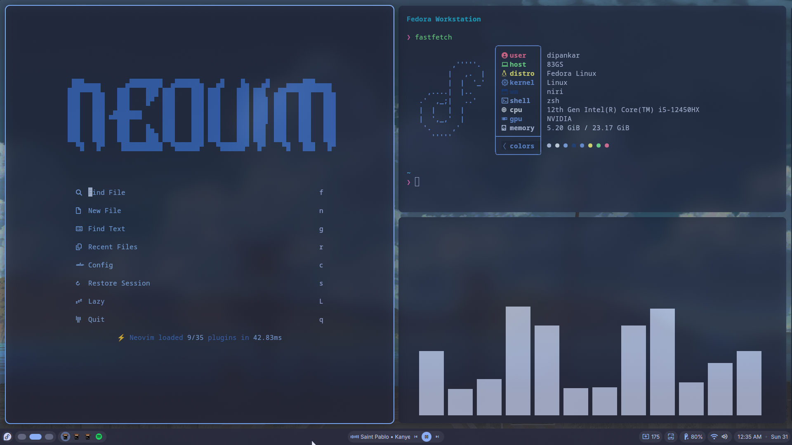
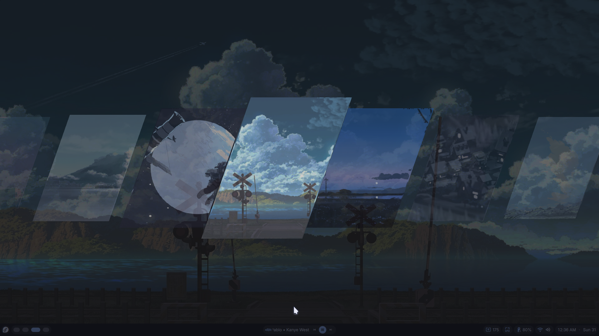
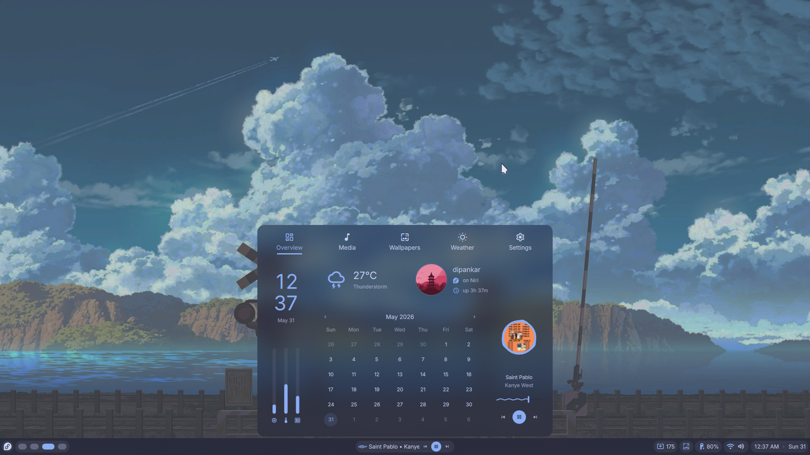
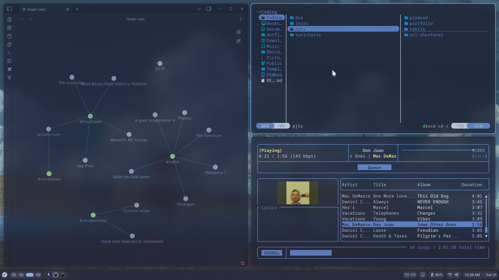

# Niri Dotfiles

My personal Linux desktop configuration built around **Niri**, featuring a Wayland workflow, Neovim development environment, and a customized terminal setup.

## Preview

<p align="center">
  
  
  
  
</p>

<p align="center">
  
</p>

## Components

### Window Manager

* Niri

### Terminal

* Kitty

### Shell

* Zsh
* Powerlevel10k
* Fish

### Editor

* Neovim (NvChad)

### Utilities

* Fastfetch
* Cava
* Zathura
* Zed
* Swaylock
* Spicetify
* MPD + RMPC

## Features

* Niri dynamic tiling workflow
* Customized Kitty configuration
* NvChad-based Neovim setup
* Fastfetch system information dashboard
* Terminal music visualization with Cava
* Spotify customization via Spicetify
* Powerlevel10k prompt configuration

## Installation

Clone the bare repository:

```bash
git clone --bare https://github.com/gottatouchsomegrass/niri-dotfiles.git $HOME/.dotfiles
```

Add the alias:

```bash
alias dotfiles='/usr/bin/git --git-dir=$HOME/.dotfiles/ --work-tree=$HOME'
```

Checkout the files:

```bash
dotfiles checkout
```

Hide untracked files:

```bash
dotfiles config --local status.showUntrackedFiles no
```

## Included Configurations

```text
.config/
├── cava
├── fastfetch
├── fish
├── kitty
├── niri
├── nvim
├── rmpc
├── spicetify
├── swaylock
├── zathura
├── zed
└── zsh
```

## Requirements

Install the required applications before checking out the configuration:

* Niri
* Kitty
* Neovim
* Zsh
* Fish
* Fastfetch
* Cava
* Zathura
* Zed
* Spicetify
* MPD
* RMPC

## Credits

* NvChad
* Niri
* Catppuccin
* Powerlevel10k

Configurations are adapted and customized for personal use.
